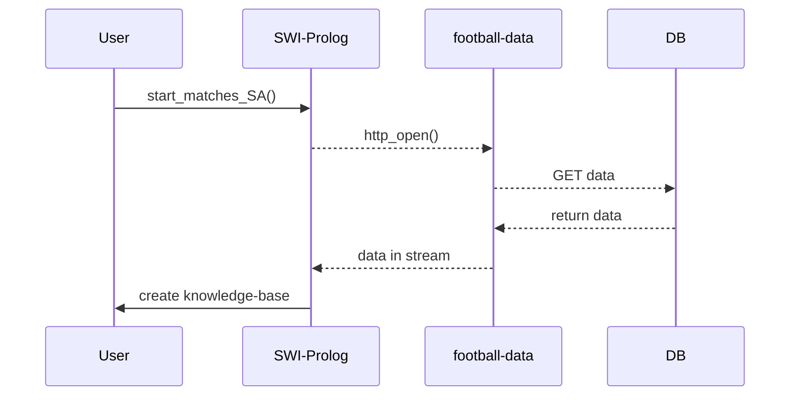
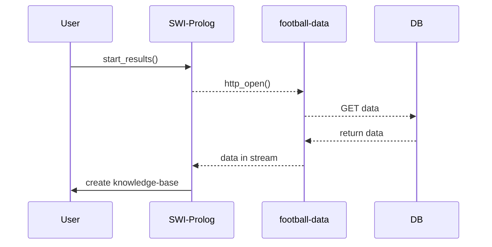

<div>
<p align="center">

</p>
<p align="center">
<a href="#Introduction">Introduction</a>&nbsp•
<a href="#How-to-install">How to install</a>&nbsp•
<a href="#How-to-use">How to use</a>&nbsp•
<a href="#How-it-works">How it works</a>&nbsp•
<a href="#Sitography">Sitography</a>&nbsp•
<a href="#Authors">Authors</a>

</p>
<br>
<br>
</div>


## Introduction
BetTactics is a simple desktop application based on [*Electron*](https://www.electronjs.org/docs/latest/) that allows users to predict some possible results of a particular Serie A's match. BetTactics uses [*football-data.org*](https://www.football-data.org/) API's to manipulate data and give results. 
## How to install
To use BetTactics you can copy url link in VSCode and copy the project. 

Now, you can run the program via SWI-Prolog or via Electron.


---
If you want to use SWI-Prolog, you should read [*SWI-Prolog Documentation*](https://www.swi-prolog.org/), then go to the section  <a href="#How-to-use">'how to use'</a>. 


---
On the other hand, if you prefer to use Electron you need to install Node.js in your pc. 

In windows, you can open terminal and run:
```
npm install -g npm
```
you can check Node.js is correctly installed in your pc running:
```
npm -v
```
Now you have to install electron, so you have to run:
```
npm install electron --save-dev
```
## How to use

then you can start the application with the follow command in command prompt:

```
npm run start
```
## How it works
To download all matches of a particular team you should run: 
```
start_matches_SA("YOUR_TEAM","YOUR_TEAM_CODE").
```
the following sequence diagram explain what happens:



## Sitography
- Swi Prolog: https://www.swi-prolog.org/
- Python: https://www.python.org/
- Ttk-inter: https://docs.python.org/3/library/tkinter.ttk.html#using-ttk
- Tk-inter: https://docs.python.org/3/library/tkinter.html
- Mermaid: https://mermaid-js.github.io/mermaid/#/

## Authors
- [*Lorenzo Longarini*](https://github.com/LorenzoLongarini)
- [*Loris Ramovini*](https://github.com/lorisramovini)

