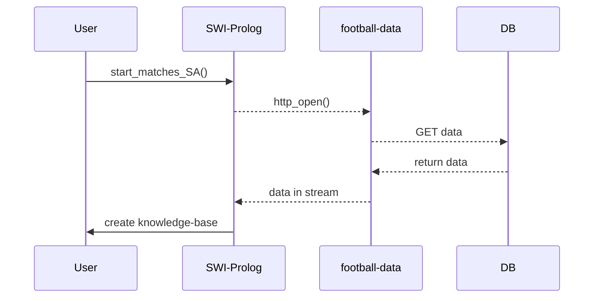
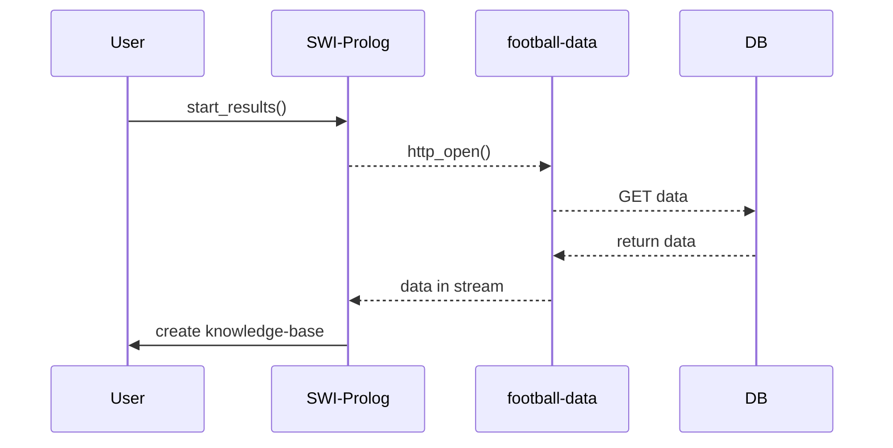

<div>
<p align="center">

</p>
<p align="center">
<a href="#Introduction">Introduction</a>&nbsp•
<a href="#How-to-install">How to install</a>&nbsp•
<a href="#How-to-use">How to use</a>&nbsp•
<a href="#How-it-works">How it works</a>&nbsp•
<a href="#Sitography">Sitography</a>&nbsp•
<a href="#Authors">Authors</a>

</p>
<br>
<br>
</div>


## Introduction
BetTactics is a simple application that allows users to predict some possible results of a particular Serie A's match. BetTactics uses [*football-data.org*](https://www.football-data.org/) API's to manipulate data and give results. 
## How to install
To use BetTactics you can copy url link in VSCode and copy the project. 

Now, you can run the program via SWI-Prolog or via Python.


---
If you want to use SWI-Prolog, you should read [*SWI-Prolog Documentation*](https://www.swi-prolog.org/), then go to the section  <a href="#How-to-use">'how to use'</a>. 


---
On the other hand, if you prefer to use Python you need to install python and tk in your pc. 

First of all you have to install python, so can follow Python [*documentation*](https://www.python.org/).

In windows, you can open terminal and run:
```
pip3 install tk
```
Now you can use gui running:
```
python gui.py
```
## How to use
If you want to use BetTactics in SWI-Prolog, first you have to create all the databases through:
```
start_matches_SA("YOUR_TEAM","YOUR_TEAM_CODE").
```
then, you have to create Serie A's standings through:
```
start_results.
```
Now, you can predict this four results, using the following function:

- to predict total win percent:
	```
	total_win_percent("TEAM", TEAM_CODE).
	```
	for example:
	```
	total_win_percent("Atalanta", 102).
	```
	will return:
	```
	La prossima partita di Atalanta : Atalanta - Lecce
	Atalanta ha una percentuale di vittoria pari al 52.39 %
	```
- to predict matchs's average score:
	```
	over_under("TEAM", TEAM_CODE).
	```
	for example:
	```
	over_under("Atalanta", 102).
	```
	will return:
	```
	La prossima partita di Atalanta : Atalanta - Lecce
	La media dei goal: 2.61
	```

- to predict if both team will score:
	```
	goal_or_not("TEAM", TEAM_CODE).
	```
	for example:
	```
	goal_or_not("Atalanta", 102).
	```
	will return:
	```
	La prossima partita di Atalanta : Atalanta - Lecce
	Una delle due squadre non segnerà
	```

- to predict if goal's sum is odd or even:
	```
	goal_odd_even("TEAM", TEAM_CODE).
	```
	for example:
	```
	goal_odd_even("Atalanta", 102).
	```
	will return:
	```
	La prossima partita di Atalanta : Atalanta - Lecce
	La somma totale dei goal e' DISPARI
	```
If you want to run other statistics rules, you can consult base_function.pl.

If you prefer to run BetTactics with python, you have tu run: 
```
python gui.py
```
it will open a window where you can select match and function. An example:
<p align="center">

</p>

you can run a rule click on the button:
<p align="center">

</p>

## How it works
To download all matches of a particular team you should run: 
```
start_matches_SA("YOUR_TEAM","YOUR_TEAM_CODE").
```
the following sequence diagram explain what happens:


To download Serie A's standings you should run: 
```
start_results.
```
the following sequence diagram explain what happens:


## Sitography
- Swi Prolog: https://www.swi-prolog.org/
- Python: https://www.python.org/
- Ttk-inter: https://docs.python.org/3/library/tkinter.ttk.html#using-ttk
- Tk-inter: https://docs.python.org/3/library/tkinter.html
- Mermaid: https://mermaid-js.github.io/mermaid/#/

## Authors
- [*Lorenzo Longarini*](https://github.com/LorenzoLongarini)
- [*Loris Ramovini*](https://github.com/lorisramovini)

